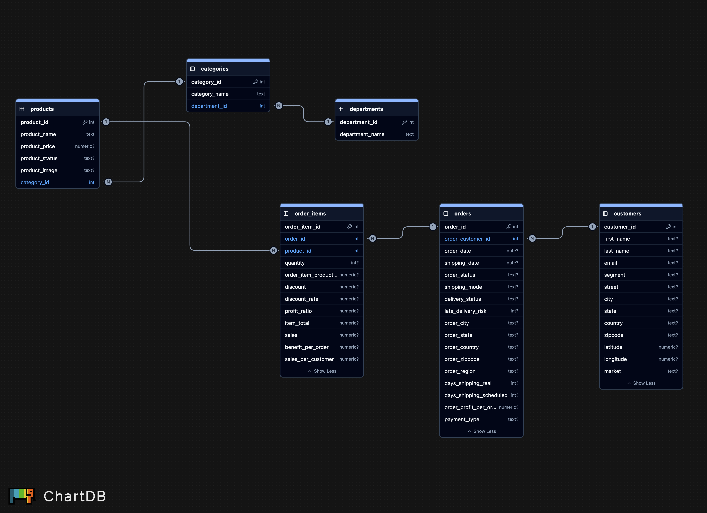
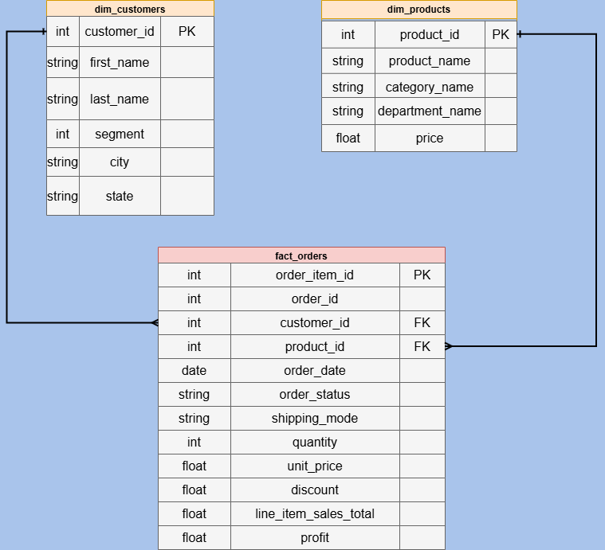
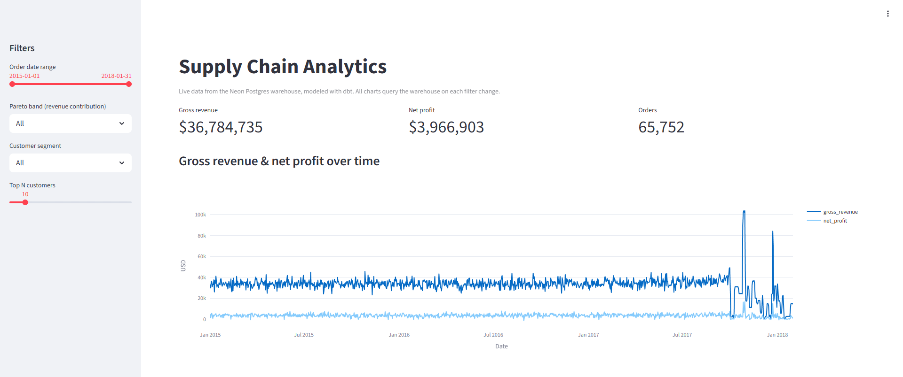
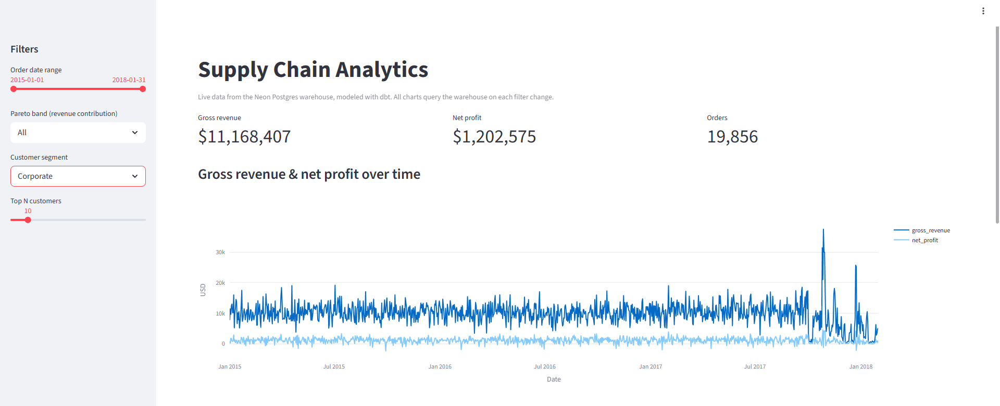
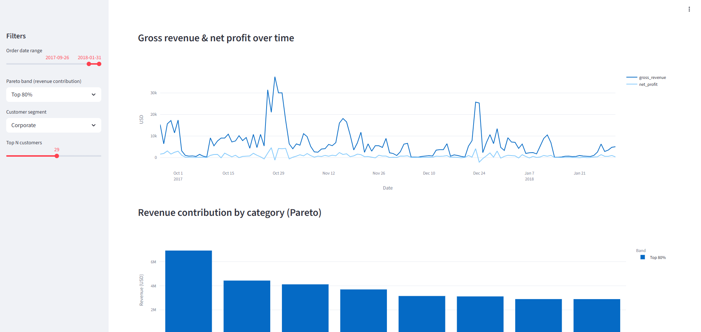
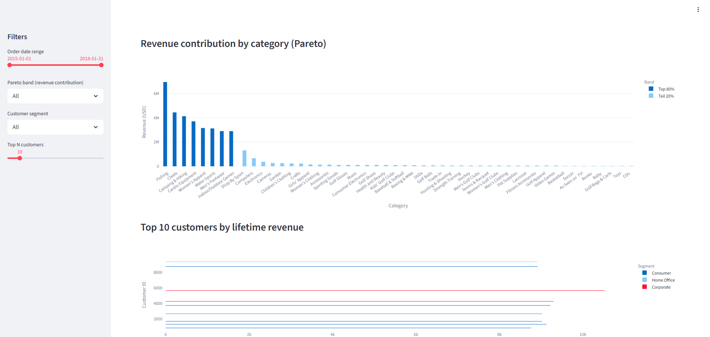
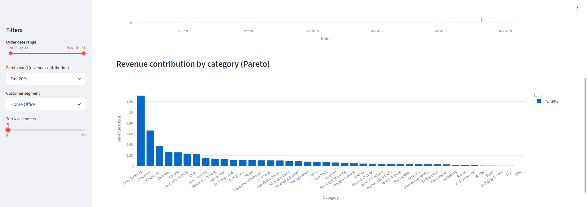
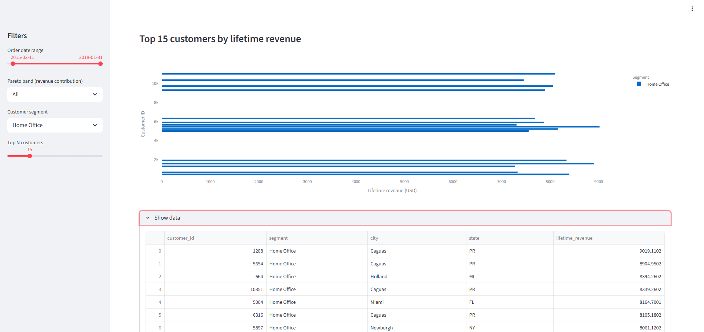

# Supply Chain Data Pipeline

[](https://youtu.be/BUOzIpEk3aI)
[](https://supply-chain-data-pipeline.streamlit.app/)

Our end-to-end data engineering pipeline that ingests the DataCo supply chain dataset into PostgreSQL and transforms it into a 3NF database, with further transformations into a star schema to make the data analytics-ready.

## Setup

### Prerequisites
- Python 3.10 or higher
- PostgreSQL database (preferably hosted on Neon)

### Installation

```bash
git clone https://github.com/kn58buff/eas550-final-project.git
cd eas550-final-project
pip install -r requirements.txt
```

### Configuration
Create a `.env` file in the project root with the following environment variables:

```
PGHOST=
PGDATABASE=
PGUSER=
PGPASSWORD=
PGPORT=5432
```

Which can be obtained using the database connection string on Neon:
```
postgresql://<user>:<password>@<host>/<dbname>
```

Configure dbt by adding a profile to `~/.dbt/profiles.yml`:

```yaml
eas550_final_project:
  target: dev
  outputs:
    dev:
      type: postgres
      host: <host>
      port: 5432
      user: <user>
      password: <password>
      dbname: <dbname>
      schema: public
```


## Usage

```bash
# 1. Execute schema (OLTP)
python sql/run_schema.py

# 2. Ingest raw CSV data with PostgreSQL
python src/ingestion/ingest_data.py

# 3. Build the star schema with dbt (OLAP layer)
cd eas550_final_project
dbt deps          # install dbt packages (first run only)
dbt run           # materialize staging views and core fact/dim tables
dbt test          # run schema and data quality tests
cd ..

# 4. Launch the analytics dashboard
streamlit run streamlit_app/app.py
```

---

## Architecture

```
Raw CSV Data
   │
   ▼
Python Ingestion Pipeline       (src/ingestion)
   │
   ▼
PostgreSQL Staging Tables
   │
   ▼
SQL Transformation Layer        (sql/schema.sql)
   │
   ▼
Normalized 3NF Database (OLTP)
   │
   ▼
dbt Models                      (dbt-postgres, eas550_final_project/models)
   │
   ▼
Star Schema (OLAP)
   │
   ▼
Streamlit Analytics Dashboard   (streamlit_app/)
```

Per project instructions, the initial stages of our pipeline ingested data into a **OLTP**, 3NF database, then transformed that data into a denormalized star schema **OLAP**-style for analytics. We achieved this transformation with **dbt**, giving us versioned, testable SQL models that produce the fact and dimension tables consumed by the dashboard.

## Features

**CSV Data Ingestion**
- Automated ingestion of raw CSV datasets into PostgreSQL staging tables
- Modular Python pipeline designed for scalable, repeatable loads

**Relational Database Design**
- PostgreSQL schema in Third Normal Form (3NF)
- Eliminates redundancy and enforces clear entity relationships

**SQL-Based Transformation**
- Raw CSVs land in staging, then transform into normalized 3NF tables via SQL
- Clean separation between ingestion and modeling concerns

**OLTP → OLAP Modeling with dbt**
- dbt-postgres models transform the 3NF database into a star schema
- Fact and dimension tables built declaratively, with version control and lineage
- Powers the analytics dashboard with query-friendly denormalized views

**Production-Style Architecture**
- Modular layers: ingestion → schema → transformation → analytics
- Mirrors patterns used in real-world data platforms

Why this matters: Separating ingestion from transformation improves scalability, maintainability, and data quality in real-world data platforms.

## Data Model

### ER Diagram
Entity-relationship diagram of the normalized 3NF schema.



### Star Schema
Analytics-oriented star schema derived from the 3NF model.




## Dashboard Preview

Our dashboard showcases 3 dynamic visualizations that can be adjusted via sliders and filters.

Try it live: **[eas550-supply-chain-dashboard.onrender.com](https://supply-chain-data-pipeline.streamlit.app/)**

### Gross Revenue Analytics
Revenue and profit trends that can be filtered by a date range or by customer segment.







### Revenue Contribution by Category
Determining which categories drive revenue (and which do not).





### Highest Spend
Which customers (and from which segment) spend the most



## Project Structure

```
eas550-final-project/
├── data/                         # Raw CSV datasets
├── sql/
│    ├── raw/
│    │     └── schema.sql          # Schema and normalization logic
│    └── security/   
│          └── security.sql        # Roles and permissions
├── src/
│   ├── ingestion/
│   │   └── ingest_data.py        # CSV → PostgreSQL pipeline
│   ├── utils/
│   │   ├── db_connection.py      # PostgreSQL connection utilities
│   │   └── processing.py         # Data processing helpers
├── eas550_final_project/
│          ├── models/            # dbt models (core fact + dimension, and staging tables)
|          └── tests/             # dbt test to enforce business rules
├── streamlit_app/                # Streamlit analytics dashboard
├── reports/                      # Reports, diagrams, and videos
├── render.yaml                   # Render deployment config
└── requirements.txt
```

## Tech Stack

| Layer            | Tools                                |
| ---------------- | ------------------------------------ |
| Language         | Python 3.10+                         |
| Database         | PostgreSQL (hosted on Neon)          |
| Data Processing  | Pandas, NumPy                        |
| DB Connectivity  | SQLAlchemy, psycopg2                 |
| Transformations  | SQL, dbt-postgres                    |
| Dashboard        | Streamlit (deployed on Render)       |
| Tooling          | sqlfluff, python-dotenv, Git         |

## Authors

- Kevin Nguyen
- Tsomorlig Khishigbold
- Vedant Shinde
- Aditya More

## License

Coursework project. Not licensed for commercial reuse.